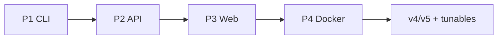
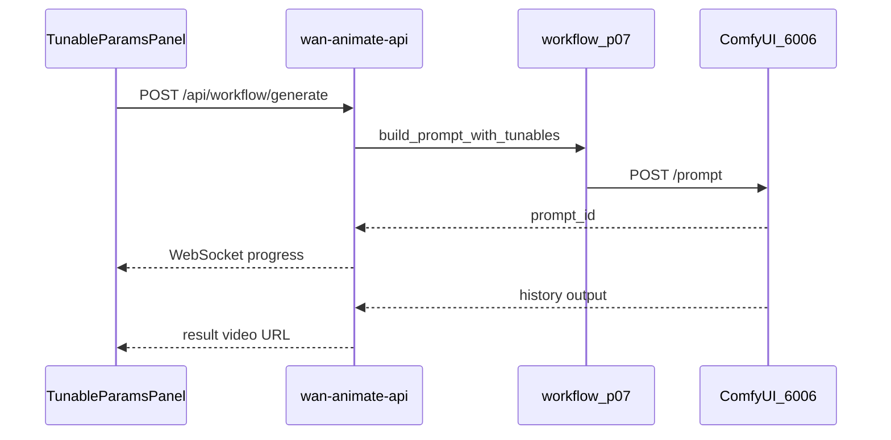

# zfhs-wan-animate 开发与构建全景

本文档记录项目从 zealman 面板抽离、分阶段交付、资产迁移、前端开发与 Docker 打包的完整方式，供后续维护与部署参考。

## 1. 项目背景与目标

**zfhs-wan-animate** 是从 zealman 面板 **P07 Wan2.2 Animate** 工作流抽离出的独立子项目，目标：

- 将「动作迁移」能力封装为可复用的 **Python 库 + CLI + HTTP API + Web UI**
- 与母环境 [`/root/zealman-app`](../../zealman-app) 解耦：模型与 ComfyUI 仍驻留宿主机，本子项目只携带 **API Prompt 工作流**、网关代码、前端与 Docker 打包脚本
- 支持 **AutoDL 裸机开发** 与 **Docker 瘦镜像部署** 两种模式

### 与 zealman-app 的关系

| 资源 | 位置 | 本子项目如何处理 |
|------|------|------------------|
| ComfyUI 安装 | `/root/ComfyUI` | 运行时 HTTP 连接 6006；Docker 内自建 ComfyUI |
| 模型权重（33.5GB） | `ComfyUI/models/` | 外挂卷，不进入 Git / 不烘焙镜像 |
| Custom nodes（8 个） | `ComfyUI/custom_nodes/` | Docker 构建前复制到 `docker/vendor/` |
| UI 格式工作流 | `zealman-app/comfyui-workflows/` | 画布 Load 用；本子项目用 API 格式 |
| API Prompt 工作流 | `workflows/p07_animate_v4.json` / `v5.json` | 核心交付物 |

---

## 2. 分阶段交付（P1–P4 + 后续）



| 阶段 | 交付物 | 验收 |
|------|--------|------|
| **P1** | `src/zfhs_wan_animate/`、`scripts/run_p07.py` | [ACCEPTANCE.md](../ACCEPTANCE.md) — 30s 生成约 10 分钟 |
| **P2** | `wan-animate-api/` FastAPI 网关 | `wan-animate-api/scripts/test_api_acceptance.py` |
| **P3** | `wan-animate-web/` 莫兰迪 React SPA | [ACCEPTANCE_P3.md](../ACCEPTANCE_P3.md) |
| **P4** | `docker/` 瘦镜像 + compose | [ACCEPTANCE_P4.md](../ACCEPTANCE_P4.md)、[DOCKER.md](./DOCKER.md) |
| **后续** | v4/v5 双预设、13 项 tunables、Notebook、一键启动 | 前端 build 通过、config-driven tunables |

### P1：CLI 与核心库

- **`workflow_p07.py`**：加载 API Prompt JSON、`build_prompt_with_tunables`、`apply_input_values`（任意 `节点:字段` 写入）
- **`runner.py`**：提交 ComfyUI、轮询、取输出、音轨 fallback
- **`comfy_client.py`**：HTTP 封装（upload、prompt、history、interrupt）
- **配置**：`config/default.yaml` + 可选 `config/local.yaml`（AutoDL 路径覆盖）

### P2：API 网关

- 端口 **6020**，对齐 zealman 面板 API 契约
- 路由：`/api/workflow/config`、`/api/workflow/generate`、`/api/comfy/status`、`/api/comfy/proxy/ws`
- 任务历史：`wan-animate-api/data/jobs.json`（Docker 挂载 `/app/data`）
- 支持 `workflow_variant`（v4/v5）与 `tunables` 覆盖

### P3：莫兰迪前端

- React + Vite + Tailwind，莫兰迪色系双栏布局
- 上传区、工作流预设、高级参数、进度 WebSocket、结果预览
- 生产：`npm run build` → API 托管 `wan-animate-web/dist/`

### P4：Docker 瘦镜像

- 单容器：ComfyUI（6006 容器内）+ API/前端（6020 对外）
- 模型通过 `docker/volumes/models` 只读挂载
- 详见 [DOCKER.md](./DOCKER.md)

### 后续增强（当前已完成）

- **双工作流预设**：v4 标准动作迁移 / v5 保身份动作迁移
- **13 项 tunables**：身份与姿态、采样、LoRA、提示词（config 驱动 schema）
- **Notebook**：`notebooks/p07_pipeline.ipynb` 分步教学
- **一键启动**：`scripts/start-wan-animate.sh --with-comfy [--dev]`
- **ComfyUI 模板 URL**：`scripts/setup_comfy_p07_template.sh`

---

## 3. 资产抽离与迁移

### 3.1 模型（33.5GB，不进入 Git）

清单由 `scripts/inventory_assets.py --write` 生成，见 [ASSETS_MIGRATION.md](./ASSETS_MIGRATION.md)。

主要文件：

- Wan2.2 Animate 14B fp8（16GB）
- umt5 文本编码器、VAE、CLIP Vision
- 5 路 LoRA（重光照、Lightning 4步、FastWan、Pusa、Fun）
- ONNX 姿态检测（vitpose、yolov10）

Docker 部署：`bash scripts/prepare_docker_volumes.sh` 将宿主机模型软链到 `docker/volumes/models/`。

### 3.2 Custom Nodes（8 个，烘焙进镜像）

构建前执行：

```bash
bash scripts/prepare_docker_build.sh
```

从 `$COMFYUI_ROOT/custom_nodes` 复制到 `docker/vendor/custom_nodes/`：

| 节点包 | 关键 ComfyUI 类 |
|--------|-----------------|
| ComfyUI-WanVideoWrapper | WanVideoSampler, WanVideoLoraSelectMulti, … |
| ComfyUI-WanAnimatePreprocess | PoseAndFaceDetection, DrawViTPose |
| ComfyUI-KJNodes | ImageResizeKJv2 |
| ComfyUI-VideoHelperSuite | VHS_LoadVideo, VHS_VideoCombine |
| ComfyUI-Easy-Use | easy mathInt |
| reservedvram | ReservedVRAMSetter |
| comfyui_memory_cleanup | VRAMCleanup |
| ComfyUI_essentials | BatchCount+ |

**注意**：`docker/vendor/custom_nodes/` 不提交 Git（约 69MB 第三方代码），克隆后需重新运行 `prepare_docker_build.sh`。

### 3.3 工作流格式

| 格式 | 路径 | 用途 |
|------|------|------|
| API Prompt | `workflows/p07_animate_v4.json`、`p07_animate_v5.json` | CLI / API / Notebook `/prompt` |
| UI 画布 | `zealman-app/comfyui-workflows/P07-...json` | ComfyUI 6006 手动 Load |
| 模板 URL | `?template=p07_wan22_animate_v4&source=zealman-workflow-templates` | 书签一键打开画布 |

### 3.4 配置分层

| 文件 | 场景 | Git |
|------|------|-----|
| `config/default.yaml` | Docker / 通用默认（`/app/...` 路径） | 提交 |
| `config/local.yaml` | AutoDL 裸机（`/root/ComfyUI` 路径） | **不提交** |
| `config/local.yaml.example` | 模板 | 提交 |

---

## 4. 架构与数据流

### 4.1 端口对照

| 端口 | 服务 | 说明 |
|------|------|------|
| **6006** | ComfyUI 原生 UI | 节点画布、Queue Prompt |
| **6020** | wan-animate-api + SPA | 一键生成页（莫兰迪 UI） |
| **5173** | Vite dev | 前端热更新（`--dev`） |

### 4.2 生成链路



### 4.3 配置驱动调参

1. `config/default.yaml` 定义 `tunables[]`（key、type、group、hint）
2. `workflow_service.get_config` 调用 `extract_tunable_defaults(workflow_path, keys)` 提取各 variant 默认值
3. 前端 `GET /api/workflow/config` → `TunableParamsPanel` 按 group 渲染
4. 提交时 `tunables` 为 `{ "62:pose_strength": 0.65, ... }` map
5. `apply_input_values` 写入对应节点 `inputs`

### 4.4 关键节点映射

| 节点 | 字段 | 说明 |
|------|------|------|
| 57 | image | 角色参考图 |
| 997 | video | 动作参考视频（含音轨） |
| 1001/1002/1003 | value | 宽 / 高 / 帧数 |
| 62 | pose_strength, face_strength | 姿态与表情跟随 |
| 27 | steps, denoise_strength | 采样 |
| 171 | strength_0…4 | LoRA 强度（0=关） |
| 65 | positive_prompt, negative_prompt | 提示词 |
| 996 | draw_head | 姿态骨架是否绘制头部 |
| 867 | — | VHS 输出（含音轨 mux） |

---

## 5. 开发方式

### 5.1 AutoDL 裸机（推荐日常开发）

```bash
cd /root/zfhs-wan-animate
cp config/local.yaml.example config/local.yaml   # 首次
bash scripts/start-wan-animate.sh --with-comfy          # ComfyUI + API + 前端
bash scripts/start-wan-animate.sh --with-comfy --dev    # 额外 Vite 5173
bash scripts/start-wan-animate.sh --stop
```

访问：`http://127.0.0.1:6020/`

### 5.2 分离终端（前端热更新）

```bash
# 终端 1
uvicorn app:app --app-dir wan-animate-api --host 0.0.0.0 --port 6020

# 终端 2
cd wan-animate-web && npm install && npm run dev
```

访问：`http://127.0.0.1:5173/`（代理到 6020 API）

### 5.3 Notebook 教学

```bash
jupyter notebook notebooks/p07_pipeline.ipynb
```

从上到下执行：配置 → 资产自检 → 上传 → 构建 prompt → 提交 → 轮询 → 预览。

详见 [notebooks/README.md](../notebooks/README.md)。

### 5.4 Docker 部署

```bash
bash scripts/prepare_docker_build.sh
bash scripts/prepare_docker_volumes.sh
bash scripts/validate_docker_setup.sh
cd docker && docker compose build && docker compose up -d
```

详见 [DOCKER.md](./DOCKER.md)。

---

## 6. 前端开发要点

### 6.1 技术栈

- **React 19** + **Vite 8** + **Tailwind CSS 4**
- 主题：`wan-animate-web/src/theme/morandi.ts`
- 类型：`wan-animate-web/src/types/workflow.ts`、`api.ts`

### 6.2 目录结构

```
wan-animate-web/src/
├── pages/AnimatePage.tsx       # 主页面
├── components/
│   ├── controls/               # 预设、高级参数、控制面板
│   ├── upload/UploadZone.tsx
│   ├── preview/                # 进度、结果视频
│   └── layout/
├── hooks/
│   ├── useGenerate.ts          # 生成状态、tunables、variant
│   ├── useWorkflowConfig.ts
│   └── useComfyProgress.ts     # WebSocket
└── api/client.ts
```

### 6.3 Tunable 类型与 UI

| type | 渲染 | 示例键 |
|------|------|--------|
| float | 滑块 0–1 | `62:pose_strength` |
| bool | 复选框 | `996:draw_head` |
| select | 下拉 | `64:crop_position` |
| int | 数字输入 | `27:steps` |
| text | textarea | `65:positive_prompt` |
| lora_switch | 开关 + 滑块（关=0） | `171:strength_1` |

分组（`group` 字段）：identity / sampler / lora / prompt

切换 v4↔v5 时，`selectWorkflowVariant` 重置 tunables 为对应 JSON 默认值。

### 6.4 构建与发布

```bash
cd wan-animate-web
npm ci
npm run build    # 输出 dist/
```

API 在生产模式自动托管 `dist/`；Docker 多阶段构建在 `web-builder` 阶段执行 `npm run build`。

---

## 7. 目录总览

```
zfhs-wan-animate/
├── config/                 # default.yaml + local.yaml（gitignore）
├── workflows/              # p07_animate_v4.json, v5.json
├── manifest/               # models.yaml, nodes.yaml, custom_nodes.yaml
├── src/zfhs_wan_animate/   # 核心 Python 库
├── wan-animate-api/        # FastAPI 网关
├── wan-animate-web/        # React 前端
├── notebooks/              # Jupyter 教学
├── scripts/                # CLI、验证、Docker 准备
├── docker/                 # Dockerfile, compose, entrypoint
├── docs/                   # 本文档、DOCKER、ASSETS_MIGRATION
├── ACCEPTANCE*.md          # 各阶段验收记录
└── README.md
```

---

## 8. 已知限制与待办

| 项 | 说明 |
|----|------|
| `docker/vendor/` | 不提交 Git，构建前必须 `prepare_docker_build.sh` |
| ComfyUI 模板 URL | 安装后需**重启 ComfyUI** 才生效 |
| 模型体积 | 33.5GB，需提前准备或软链 |
| zealman-app 只读 | P07 模板用 `setup_comfy_p07_template.sh` 代替 `update-symlinks.sh` |
| 完整生成耗时 | 30s 视频约 10+ 分钟（视 GPU 与 steps） |

---

## 9. 相关文档索引

| 文档 | 内容 |
|------|------|
| [README.md](../README.md) | 快速开始、端口、CLI |
| [DOCKER.md](./DOCKER.md) | Docker 构建、compose、排错 |
| [ASSETS_MIGRATION.md](./ASSETS_MIGRATION.md) | 模型与节点清单 |
| [notebooks/README.md](../notebooks/README.md) | Notebook 使用说明 |
| [wan-animate-api/README.md](../wan-animate-api/README.md) | API 路由与验收 |
| [wan-animate-web/README.md](../wan-animate-web/README.md) | 前端开发说明 |
| [ACCEPTANCE.md](../ACCEPTANCE.md) | P1 验收 |
| [ACCEPTANCE_P3.md](../ACCEPTANCE_P3.md) | P3 验收 |
| [ACCEPTANCE_P4.md](../ACCEPTANCE_P4.md) | P4 Docker 验收 |

---

*最后更新：2026-06-24*
